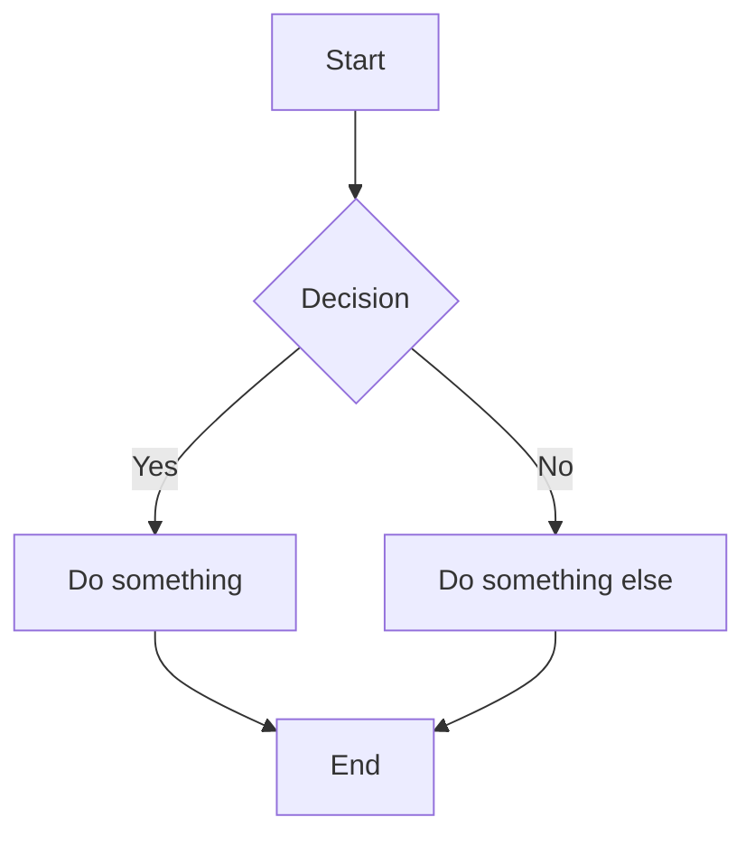

# Pandoc VS Code Extension — Sample Document

This file demonstrates all built-in Lua filters. Convert it to DOCX, HTML, or PDF using the command palette or right-click menu.

## How to Use <!-- {#how-to-use} -->

1. **Convert this file**: Right-click in the editor or Explorer → Pandoc → Choose format (DOCX, HTML, or PDF)
2. **Convert a folder**: Right-click a folder in the Explorer → Pandoc → Choose format (DOCX, HTML, or PDF)
3. **Generate Sample Markdown**: Right-click in the editor or Explorer → Pandoc → Generate Sample Markdown
4. **Command Palette**: Press `Cmd+Shift+P` (macOS) or `Ctrl+Shift+P` (Windows/Linux) → type "Pandoc"

---

## Prerequisites

You need the following tools installed:

- **Pandoc** ([Install guide](https://pandoc.org/installing.html))
- **Mermaid CLI** (`mmdc`) for rendering Mermaid diagrams ([Install guide](https://github.com/mermaid-js/mermaid-cli))

Mermaid CLI requires Node.js and npm to be installed first.

### Install Example (macOS)

```sh
brew install pandoc
npm install -g @mermaid-js/mermaid-cli
```

### Install Example (Windows)

```powershell
winget install --id JohnMacFarlane.Pandoc -e
npm install -g @mermaid-js/mermaid-cli
```

<!-- pagebreak -->

## Configuration <!-- {#configuration} -->

Add these to your VS Code settings (`settings.json`):

```json
{
  "pandoc.filters": [
    "builtin:header-id-from-comment",
    "builtin:html-br-to-linebreak",
    "builtin:mermaid-filter",
    "builtin:page-break",
    "${workspaceFolder}/my-project-filters/word-count.lua"
  ],
  "pandoc.docx.commonArgs": [
    "--reference-doc=${workspaceFolder}/my-project-templates/template.docx",
    "--toc"
  ],
  "pandoc.docx.multipleFilesCustomArgs": [
    "--reference-doc=${workspaceFolder}/my-project-templates/cover.docx",
    "--number-sections"
  ],
  "pandoc.html.commonArgs": [
    "--standalone",
    "--embed-resources"
  ],
  "pandoc.pdf.commonArgs": [
    "--pdf-engine=xelatex"
  ]
}
```

### Format-Specific Notes

- **HTML** — Without `--standalone --embed-resources`, Pandoc emits an unstyled HTML fragment with no `<html>`/`<head>` wrapper, and Mermaid images are referenced by relative path (so moving the `.html` file breaks them). The args above produce a single self-contained file with syntax-highlighting CSS and base64-inlined images.
- **PDF** — Requires a TeX install (MacTeX or TinyTeX on macOS, MiKTeX on Windows). Use `--pdf-engine=xelatex` or `lualatex` to handle Unicode characters like the `•` bullets in the multi-line table example below — the default `pdflatex` will fail on them.

---

### Conversion Arguments <!-- {#conversion-arguments} -->

- `pandoc.{format}.commonArgs` — arguments applied to all conversions of that format
- `pandoc.{format}.singleFileCustomArgs` — additional arguments for single file conversion
- `pandoc.{format}.multipleFilesCustomArgs` — additional arguments for folder conversion

Where `{format}` is `docx`, `html`, or `pdf`.

---

### Filters <!-- {#filters} -->

- Use `builtin:<name>` for built-in filters
- Use `${workspaceFolder}/path/to/filter.lua` for custom filters
- Use absolute paths as an alternative for custom filters
- Order matters — filters run in the order listed
- Remove a filter from the list to disable it
- Set to `[]` to disable all filters

---

## Built-in Filters <!-- {#built-in-filters} -->

The sections below demonstrate each built-in filter in action.

## Header IDs and Cross-References <!-- {#header-ids} -->

This heading has a custom ID. You can link to it from anywhere in the document like this: [Back to How to Use](#how-to-use).

Where `section-id` is the ID of the target section. Section IDs can be customised using the following syntax:

```markdown
## Custom Section Title <!-- {#section-id} -->
```

## Line Breaks <!-- {#line-breaks} -->

This line has a break here<br>and continues on the next line.

You can also use the self-closing form:<br>like this.

## Page Breaks <!-- {#page-breaks} -->

To add a page break before a section, add the following line at the start of the section in the Markdown file:

```markdown
<!-- pagebreak -->
```

<!-- pagebreak -->

## Mermaid Diagram <!-- {#mermaid-diagram} -->

To include Mermaid diagrams, add the diagram code block in the Markdown file.

Place an HTML comment immediately before the fence to pass render options to the Lua filter. GitHub and other viewers ignore the comment and render the plain `mermaid` fence normally.

**Supported attributes (set in the comment):**

- scale: Multiplies base diagram resolution.
- width: Target width in pixels (forwarded to mmdc -w). Optional.
- background: Background color or 'transparent'. Default MERMAID_BACKGROUND or 'transparent'.
- format: png | svg | pdf | webp (limited by mermaid-cli support). Default MERMAID_FORMAT or png.

````markdown
<!-- mermaid scale=3 width=300 background=white format=png -->

````

The rendered output:

<!-- mermaid scale=3 width=300 background=white format=png -->


## Tables <!-- {#tables} -->

Pandoc supports different table formats including pipe tables, multiline tables and grid tables. For consistency, use pipe tables everywhere to ensure compatibility with major markdown viewers and editors.

**Pipe Table Example:**

```markdown
| Header 1 | Header 2 |
|----------|----------|
| Row 1    | Data     |
```

| Header 1 | Header 2 |
|----------|----------|
| Row 1    | Data     |

**Multi-line Pipe Table Example:**

```markdown
| Header 1  | Header 2               |
|-----------|------------------------|
| Row 1     | Item 1<br>Item 2       |
| Row 2     | • List 1<br>• List 2   |
```

| Header 1  | Header 2               |
|-----------|------------------------|
| Row 1     | Item 1<br>Item 2       |
| Row 2     | • List 1<br>• List 2   |

**Table with Alignment and Spacing:**

- Use colons `:` to set alignment for each column.
- Use tabs or spaces to add padding within cells and allow word to auto-size columns.

```markdown
| Left Align              | Centre Align              | Right Align             |
|:------------------------|:-------------------------:|------------------------:|
| Data                    | Data                      | Data                    |
```

| Left Align              | Centre Align              | Right Align             |
|:------------------------|:-------------------------:|------------------------:|
| Data                    | Data                      | Data                    |
