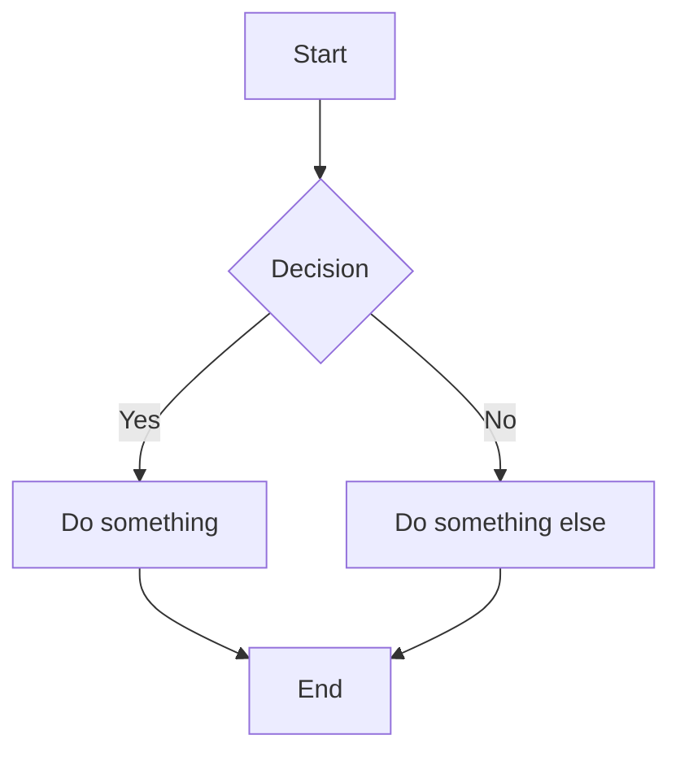

# Pandoc VS Code Extension — Sample Document

This file demonstrates all built-in Lua filters. Convert it to DOCX, HTML, or PDF using the command palette or right-click menu.

## How to Use <!-- {#how-to-use} -->

1. **Convert this file**: Right-click in the editor or Explorer → Pandoc → Choose format (DOCX, HTML, or PDF)
2. **Command Palette**: Press `Cmd+Shift+P` (macOS) or `Ctrl+Shift+P` (Windows/Linux) → type "Pandoc"

## Configuration <!-- {#configuration} -->

Add these to your VS Code settings (`settings.json`):

```json
{
  "pandoc.filters": [
    "builtin:header-id-from-comment",
    "builtin:html-br-to-linebreak",
    "builtin:mermaid-filter",
    "builtin:page-break"
  ],
  "pandoc.docx.commonArgs": [
    "--reference-doc=template.docx",
    "--toc"
  ]
}
```

### Filters <!-- {#filters} -->

- Use `builtin:<name>` for built-in filters
- Use `${workspaceFolder}/path/to/filter.lua` for custom filters
- Use absolute paths as an alternative for custom filters
- Order matters — filters run in the order listed
- Remove a filter from the list to disable it
- Set to `[]` to disable all filters

### Conversion Arguments <!-- {#conversion-arguments} -->

- `pandoc.{format}.commonArgs` — arguments applied to all conversions of that format
- `pandoc.{format}.singleFileCustomArgs` — additional arguments for single file conversion
- `pandoc.{format}.multipleFilesCustomArgs` — additional arguments for folder conversion

Where `{format}` is `docx`, `html`, or `pdf`.

---

## Filter Examples <!-- {#filter-examples} -->

The sections below demonstrate each built-in filter in action.

## Header IDs and Cross-References <!-- {#header-ids} -->

This heading has a custom ID. You can link to it from anywhere in the document like this: [Back to Header IDs](#header-ids).

You can also link to other markdown files: [See the README](./README.md).

## Line Breaks <!-- {#line-breaks} -->

This line has a break here<br>and continues on the next line.

You can also use the self-closing form:<br/>like this.

<!-- pagebreak -->

## Mermaid Diagram <!-- {#mermaid-diagram} -->

The diagram below will be rendered as an image in DOCX output (requires mermaid-cli installed).



<!-- pagebreak -->

## Final Section <!-- {#final-section} -->

This section appears after a page break. The document demonstrates:

- Custom header IDs and cross-references
- HTML line breaks converted to native breaks
- Mermaid diagrams rendered as images
- Page breaks between sections
